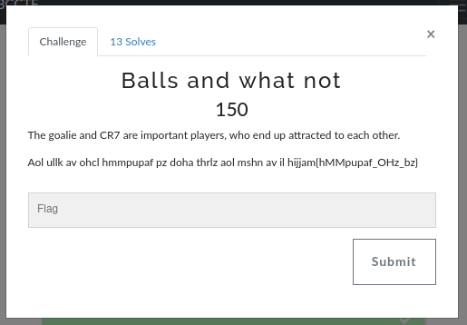
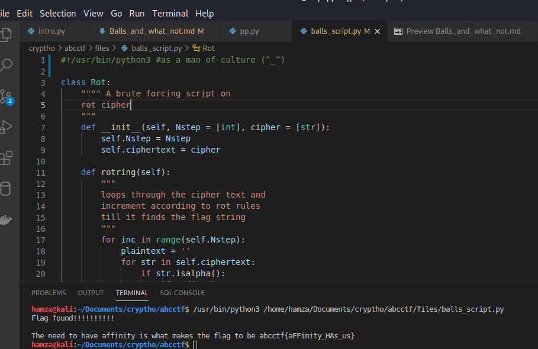

# Balls and what not



We could see that the challenge is talking about our favourite footballer CR7 and how important he is with the goalie.


```
Aol ullk av ohcl hmmpupaf pz doha thrlz aol mshn av il hijjam{hMMpupaf_OHz_bz}
```
Analyzing the cipher text in decode.fr we have a [ROT](https://en.wikipedia.org/wiki/ROT13) cipher here

Even though there are websites i could use to decrypt it, i decided to do some python [script](../files/balls_script.py), The aim of the script is to bruteforce cipher text until we have a string relating to the beginning of the flag. fell free to check it out. 

Executing the script we have



After some secs we finally have an output xd.

the flag is **abcctf{aFFinity_HAs_us}**
