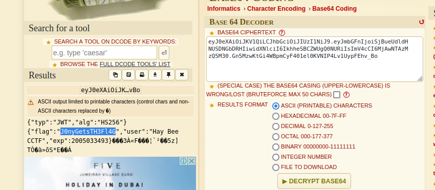

# JanwyJusCome 

Form the challenge discription "What constitutes What?, Why is Why?.

Your curiosity never bothers you" we could see that the [file ](https://github.com/hamza34-del/abcctf/blob/main/files/JawnyJusCome) contains some cipher text with some embeddings in it.

using dcode to analyze it we see that its a base64 encoding 

looking further at the decrypted base64 encoding we found out its a jwt (known as javascript web token) 

extracting the flag from the token we have

**abcctf{J0nYGetsTh3Fl4G}**