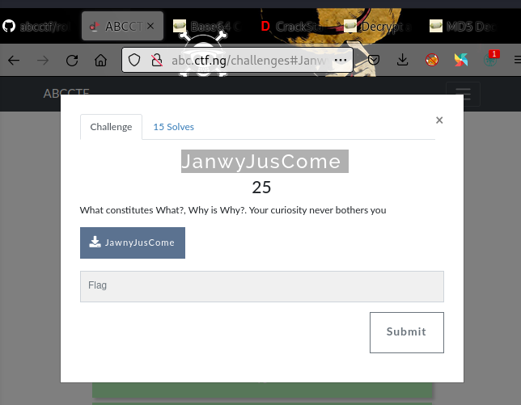

# JanwyJusCome 

form the challenge discription "What constitutes What?, Why is Why?. Your curiosity never bothers you" we could see that the [file ](https://github.com/hamza34-del/abcctf/blob/main/files/JawnyJusCome)contains some cipher text with some embeddings in it 

using dcode to analyze it we see that its a base64 encoding 

<<<<<<< HEAD:crypto/JanwyJusCome .md
looking further at the decrypted base64 encoding we found out its a jwt (known as javascript web token)encypted text 
=======
looking further at the decrypted base64 encoding we found out its a jwt (known as javascript web token)encypted text
>>>>>>> bf0a647192a03058b3561822363b6ff4acdd15fe:crypto/JanwyJusCome.md
