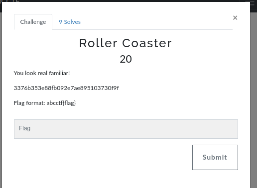
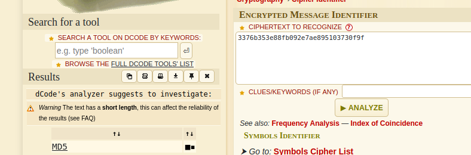
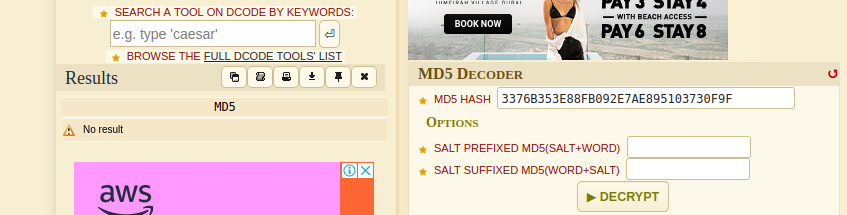
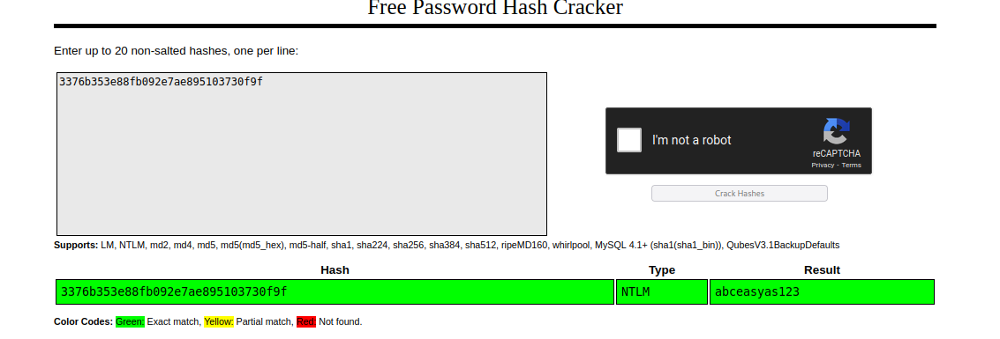

# Roller Coaster

This another easy challenge using [dcode](https://www.dcode.fr/cipher-identifier) to analyze it we have

i found out it's an MD5 hash

decrypting with their tool, i didn't get any result

Using another tool call [crackstation](https://crackstation.net/) notoriously known for cracking hashes

And walla!! 
we get the flag to be **abceasyas123
**