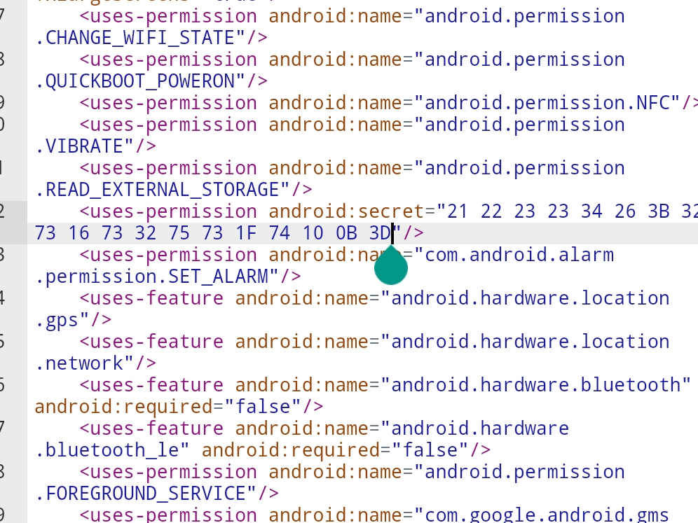

# Reverse Apk


This is the first challenge that i get to write in my death Note


the challenge is  also one of our very first blood. It was quiet interesting
since its the very first kind of a challenging app rev i have get to solve.


Before decompiling the application, i tried installing it on my phone
to see the runing contents, but the application looks bugged since
its returning **package parse error** on my phone, going back to my Kali, i tried using apktools to decompile the application into a folder 
called Abcctf.apk using the following code


This are the content of the follder


After a lot of tinkering and searches which are now looking furtile,
i came across an icon.png which contain some text about some stuffs 
saved in God knows where, well the icon is looking suss


Digging further i saw another image file containg some russian text
i tried extracting the text using an online OCR tool then used google
translate to convert it back to english, i got nothing much, since the 
text was talking about setting call options and what's not relating to 
the flag.


Going into the Androidmanifest.xml file 


My eyes caught something interesting, we could see the ``` <user-permission android:secret> ```
contains some hex values, well if you could map it in your mind as 'a' as 21, 'b' as 22, and 'c' as 23
and so on, then we know the hex values looks like the beginning of the flag. 



extracting the hex and going to dcode.fr to analyze it i got this 


An Ascii shift cipher, decoding it with their tool 
and walla i got the flag, it turns out its an ascii shift cipher with a 64 turn shift.

though i used an online tool in my write up, i actually
used my hand and ascii table to decode, look at me being
lucriative xd (^_-)


abcctf{r3V3r53_4PK}
